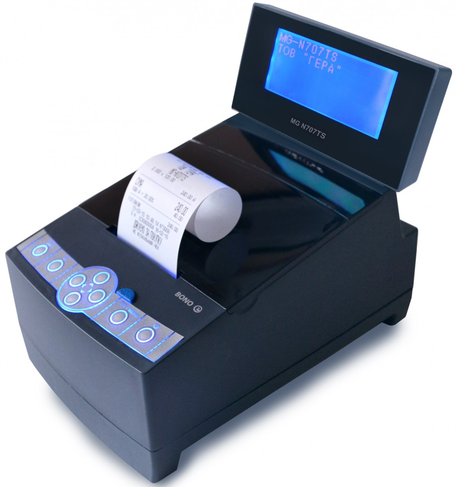

## MG-N707TS
### Библиотека для работы с кассовым аппаратом MG-N707TS из 1C Предприятие 8.3 без внешних компонент.


Данная библиотека позволяет подключить кассовый аппарат MG-N707TS без использования внешних компонент, по протоколу HTTP.
В библиотеке реализованы методы синхронизации и digest-авторизации, необходимые для работы из аппаратом.

На данный момент библиотека работает из платформой 8.3.7 и выше. При необходимости возможно адаптировать под 8.3.5.

### Рализирован следующий функционал:
1. Получение статуса (прим. далее кассвого аппарата).
2. Получение остатка денежных средств.
3. Служебное внесение денежных средств.
4. Служебное изъятие денежных средств.
5. Получение таблиц видов оплаты.
6. Получение талиц скидок.
7. Печать Z-отчета.
8. Печать X-отчета.
9. Фискальный чек продажы / возврата.
10. Фискальный чек оплаты картой / наличными / кредит.

Методы для работы из кассовым аппаратом достаточно инкапсулированы. Например для получения статуса кассового аппарата достаточно выполнить код:
``` 
ngn707ts_Операции.ЗапросСтатусКассовогоАппарата(СтруктураПодключения);
```

Более подробно из библиотекой можно ознакомится в [демо-приложении](./demo/Демо.epf).
